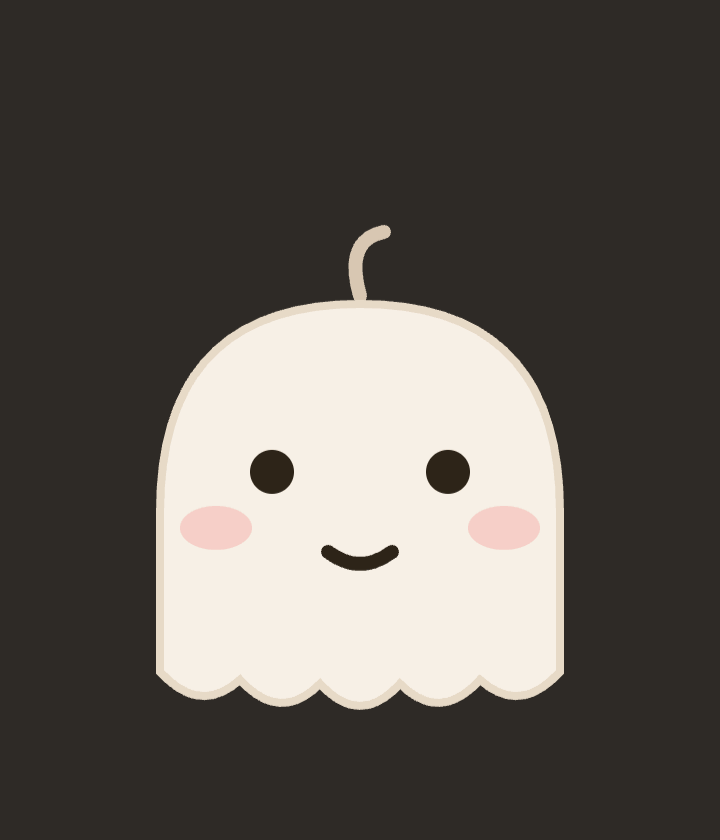

# nunchi 🐾

> a desktop pet that reads the room

**[English](README.md) | [한국어](README.ko.md) | [中文](README.zh.md)**

<p align="center"></p>

Claude Code와 연동되는 데스크톱 펫 오버레이. **사용자의 말투를 눈치채고 표정이 바뀝니다.**

기존 Claude Code 펫들이 Claude의 작업 상태(도구 실행, 대기 등)에만 반응하는 것과 달리,
nunchi는 `UserPromptSubmit` 훅으로 받은 프롬프트의 어조를 분석해서 감정을 표현합니다.

- 화내면 😰 미안해하고, 칭찬하면 🎉 신나고, 지쳐 보이면 🥺 위로합니다
- Claude의 작업 상태(생각중 / 작업중 / 허락 대기 / 휴식)도 함께 표시
- 프롬프트 원문은 어디에도 저장하지 않습니다 — 메모리에서 분류 후 감정 결과만 기록

## 표정

| 트리거 | 표정 |
|--------|------|
| 짜증/화난 말투 (`왜 안 돼??`, `짜증나`) | 미안해하며 덜덜 떨기 |
| 칭찬/기쁨 (`완벽해 고마워!`, `ㅋㅋ 좋네`) | 폴짝폴짝 점프 |
| 지친 말투 (`하... 힘들다 ㅠㅠ`) | 같이 시무룩 + 눈물 |
| 급한 말투 (`빨리!`, `asap`) | 눈 커지고 허둥지둥 |
| Claude가 도구 실행 중 | 집중해서 열일 |
| 권한 확인 대기 | 방방 뛰며 알림 |
| 도구 실행 실패 | 😨 당황하며 "앗, 뭔가 잘못됐어요" |
| 오래 걸리는 작업 (3분+) | 땀 흘리며 "아직 하는 중이에요..." |
| 작업 완료 (도구 작업 후 턴 종료) | ✨ 만세하며 "다 됐어요!" 12초 |
| 세션 종료 | Zzz |

## 아키텍처

```
Claude Code hooks ─→ bin/hook.js ─→ ~/.nunchi/state.json ─→ Electron 오버레이
   (UserPromptSubmit,   (말투 분류,      (감정 + 작업 상태만,      (투명·항상 위,
    PreToolUse, Stop…)    상태 기록)       프롬프트 원문 없음)       SVG 표정 렌더)
```

Claude Code CLI와 데스크톱 앱은 `~/.claude/settings.json`의 hooks를 공유하므로 둘 다 동작합니다.

> **참고**: 눈치는 Claude Code **세션**(CLI, 데스크톱 앱의 Code 세션)에서만 반응합니다.
> 데스크톱 앱의 Chat 탭은 로컬 훅을 실행하지 않아 지원되지 않습니다.

## 설치

### 다운로드 (추천)

[최신 릴리스](https://github.com/ysksean/nunchi/releases/latest)에서 `nunchi-<버전>-arm64.dmg`를 받아 열고, nunchi를 응용 프로그램 폴더로 드래그하세요.

아직 코드 서명 전이라 첫 실행 시 macOS Gatekeeper가 막습니다. **앱을 우클릭 → 열기 → 열기**를 누르거나, 한 번만 아래를 실행하세요:

```bash
xattr -dr com.apple.quarantine /Applications/nunchi.app
```

그다음 메뉴바 유령 아이콘 → **Claude Code 훅 설치**를 누르면 끝입니다.

### 소스에서 실행

```bash
git clone https://github.com/ysksean/nunchi.git
cd nunchi
pnpm install
pnpm hooks:install   # ~/.claude/settings.json에 훅 등록 (백업 자동 생성)
pnpm start           # 펫 실행
```

직접 DMG를 만들려면 `pnpm dist` (결과는 `dist/`에).

훅 제거:

```bash
pnpm hooks:uninstall
```

## 메뉴바 앱

실행하면 상단 **메뉴바에 유령 아이콘**이 상주합니다. 아이콘을 클릭하면:

- 펫 보이기 / 숨기기
- 스킨 선택 · 스킨 폴더 열기 · 새로고침
- Claude Code 훅 설치 / 제거 (터미널 없이)
- 로그인 시 자동 실행
- nunchi 종료

펫의 `×` 버튼은 이제 **종료가 아니라 숨기기**입니다 — 메뉴바 아이콘에서 다시 열 수 있습니다.

## 사용법

- **콕 찌르기**: 펫을 클릭하면 몸이 말랑하게 눌렸다 튕기고, 볼따구가 출렁이며 반응합니다
- 펫을 드래그해서 원하는 위치로 이동 (누르는 동안 찌부러진 채로 따라옵니다)
- **크기 조절**: 펫 위에서 마우스 휠 스크롤 — 60%~200%, 재시작해도 유지
- **쓰다듬기**: 펫 위에서 커서를 좌우로 살살 문지르면 하트가 뿅뿅 (누르지 않고)
- 펫에 마우스를 올리면 볼이 살짝 씰룩 + `×` 버튼으로 종료
- 창이 포커스된 상태에서 숫자키 1~9로 표정 미리보기 (개발용)

## 스킨

캐릭터는 JSON 한 파일로 교체합니다. 기본 제공: **ghost · cat · slime · hamster**.

```bash
pnpm skin list              # 설치된 스킨 목록
pnpm skin add <이름>         # 커뮤니티 레지스트리에서 설치
pnpm skin remove <이름>      # 삭제
```

펫을 **우클릭**하면 스킨을 바로 고를 수 있습니다.

직접 만들려면 몸통 SVG만 그리면 됩니다 — 표정 10종, 볼따구 물리, 애니메이션은 코어가 얹어줍니다.
좌표계와 허용 SVG 규격은 [docs/SKINS.md](docs/SKINS.md)를 참고하세요.
받은 스킨은 설치 전에 엄격한 화이트리스트로 새니타이즈되므로 스크립트·외부 참조는 통과하지 못합니다.

## 개발

```bash
pnpm test    # 말투 분류기 + 스킨 새니타이저 테스트
pnpm start   # 로컬 실행
```

말투 분류는 [src/mood.js](src/mood.js)의 키워드 휴리스틱입니다. 네트워크 호출 없이 즉시 동작하며,
패턴을 추가하려면 `PATTERNS`에 정규식을 넣으면 됩니다.

## 로드맵

- [ ] Haiku 기반 감정 분류 옵션 (휴리스틱보다 정확, opt-in)
- [ ] 멀티 세션 표시
- [ ] Tauri 포팅 (바이너리 경량화)
- [ ] 커스텀 펫 스킨

## License

MIT
